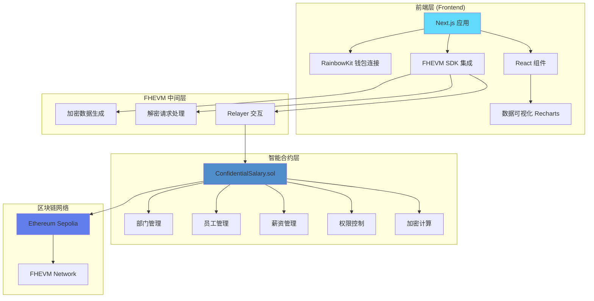
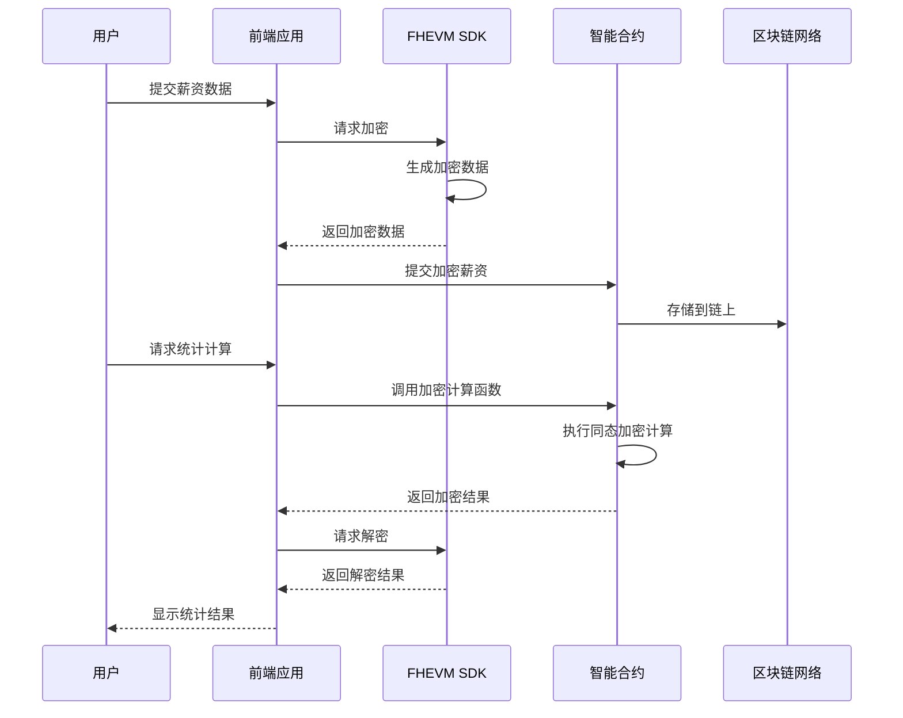

# 🔐 ConfidentialSalary

**基于全同态加密的隐私保护薪资管理系统**

[](LICENSE)
[](https://docs.zama.org)
[](https://soliditylang.org)
[](https://nextjs.org)
[](https://www.typescriptlang.org)
[](https://github.com/673342907/SalaryPrivacy/actions)
[](./packages/hardhat/coverage)

> 🏆 **Zama Developer Program 参赛项目** - 展示 FHE 技术在实际业务场景中的应用

[🌐 在线演示](#-在线演示) • [📖 文档](#-文档) • [🚀 快速开始](#-快速开始) • [💻 开发](#-开发) • [📊 功能特性](#-功能特性)

---

## 📖 项目简介

**ConfidentialSalary** 是一个创新的去中心化应用（dApp），利用 Zama 的 FHEVM（全同态加密虚拟机）技术，实现了完全隐私保护的薪资管理系统。所有薪资数据在区块链上以加密形式存储，支持在不解密的情况下进行加密数据计算，只有授权用户才能解密查看原始数据。

### 🎯 核心价值

- **🔒 完全隐私保护** - 所有薪资数据在链上加密存储，智能合约无法看到原始数据
- **📊 加密统计分析** - 在不解密原始数据的情况下进行统计计算（总和、平均值、比较等）
- **👥 基于角色的权限管理** - 细粒度的访问控制，确保数据安全
- **🏢 企业级应用** - 解决真实的 HR 管理痛点，符合数据保护法规要求
- **✅ 合规性** - 符合 GDPR、CCPA 等数据保护法规

---

## ✨ 核心特性

### 🔐 全同态加密保护
- 所有薪资数据在链上以加密形式存储
- 支持在不解密的情况下进行加密数据计算
- 只有授权用户才能解密查看原始数据
- 零知识保证：完全透明且不可篡改，同时保护数据隐私

### 👥 基于角色的权限管理
- **Admin（管理员）**: 完全权限，可以管理所有功能和分配角色
- **HR（人力资源）**: 可以创建部门、管理员工、提交薪资
- **Manager（经理）**: 可以查看部门数据和员工薪资
- **Employee（员工）**: 只能查看自己的薪资

### 🏢 完整的组织管理
- 部门创建和管理（加密预算设置）
- 员工添加和角色分配
- 加密预算设置和合规检查
- 部门间数据隔离

### 📊 隐私保护的统计分析
- 加密加法：计算部门总薪资（不解密任何员工薪资）
- 加密平均值：计算平均薪资（不解密原始数据）
- 加密比较：比较两个薪资大小（不解密原始值）
- 范围查询：查询薪资在指定范围内的员工数量
- 预算合规检查：检查部门总薪资是否在预算内（全部加密计算）

### 🎨 现代化 UI/UX
- 响应式设计，支持各种设备
- 流畅的动画效果和过渡
- 直观的用户界面
- 实时数据可视化（Recharts）
- 完整的引导流程

---

## 🏗️ 技术架构

### 技术栈

- **前端框架**: React 19 + Next.js 15.2.5
- **区块链**: Ethereum Sepolia 测试网
- **加密技术**: Zama FHEVM 0.9.0（全同态加密虚拟机）
- **智能合约**: Solidity 0.8.24
- **开发工具**: Hardhat
- **UI框架**: Tailwind CSS + DaisyUI
- **状态管理**: React Context API + Zustand
- **Web3集成**: Wagmi + RainbowKit
- **数据可视化**: Recharts
- **包管理**: pnpm (Monorepo)

### 系统架构



### 数据流架构



---

## 🌐 在线演示

### 🚀 生产环境
- **Vercel 部署**: [https://salary-privacy.vercel.app](https://salary-privacy.vercel.app)
- **GitHub 仓库**: [查看源代码](https://github.com/your-username/SalaryPrivacy)

### 📹 演示视频
- [YouTube 演示视频](#) - 完整功能演示（即将发布）
- [演示视频制作指南](./docs/DEMO_GUIDE.md) - 详细的视频制作说明

### 📸 功能截图

> **💡 提示**: 如何添加截图？请参考 [截图制作指南](./docs/SCREENSHOT_GUIDE.md)

#### 主要功能页面

<table>
<tr>
<td width="50%">

**Dashboard 首页**
- 项目概览和快速导航
- 统计卡片展示
- 功能模块入口


</td>
<td width="50%">

**部门管理**
- 创建和管理部门
- 设置加密预算
- 部门列表和详情


</td>
</tr>
<tr>
<td width="50%">

**员工管理**
- 添加员工
- 分配角色和部门
- 员工列表展示


</td>
<td width="50%">

**薪资管理**
- 提交加密薪资
- 查看薪资记录
- 加密过程可视化


</td>
</tr>
<tr>
<td width="50%">

**统计分析**
- 加密数据统计
- 可视化图表（Recharts）
- 预算合规检查


</td>
<td width="50%">

**权限管理**
- 角色权限矩阵
- 权限分配
- 权限说明文档


</td>
</tr>
</table>

#### 技术特性展示

<table>
<tr>
<td width="50%">

**FHE 加密过程可视化**
- 展示加密/解密流程
- 实时加密状态
- 安全证明展示


</td>
<td width="50%">

**安全证明和合规性**
- 零知识证明说明
- GDPR、CCPA 合规性
- 安全特性展示


</td>
</tr>
</table>

> **📝 截图说明**: 
> - 如果截图暂时不可用，请访问 [在线演示](#-在线演示) 查看实际效果
> - 截图文件位于 `docs/images/screenshots/` 目录
> - 如何添加截图请参考 [截图指南](./docs/SCREENSHOT_GUIDE.md)

---

## 📦 示例合约

项目包含 **8 个独立的 FHEVM 示例合约**，涵盖从基础到高级的各种应用场景：

### 基础示例
1. **FHEArithmetic** - 算术运算示例（加减乘除等基础操作）
2. **FHEComparison** - 比较操作示例（等于、大于、小于等）

### 实用工具示例
3. **FHEAccessControl** - 访问控制示例（FHE.allow, FHE.allowTransient）
4. **FHEInputProof** - 输入证明说明
5. **FHERangeQuery** - 范围查询示例（查询指定范围内的数据）

### 高级应用示例
6. **FHEBlindAuction** - 盲拍卖示例（隐私保护拍卖系统）
7. **FHEVestingWallet** - 加密代币锁仓示例（时间锁定的加密钱包）

### 教育示例
8. **FHEAntipatterns** - 反模式示例（展示常见错误和最佳实践）

所有示例都包含：
- ✅ 完整的文档注释
- ✅ 测试文件
- ✅ 使用示例
- ✅ 章节标签

## 🛠️ 脚手架工具

项目包含 `create-fhevm-example` CLI 工具，可以快速创建新的示例项目：

```bash
# 创建新示例
npx create-fhevm-example example my-example

# 创建新分类
npx create-fhevm-example category advanced
```

## 🚀 快速开始

### 前置要求

- **Node.js** 18+ 
- **pnpm** (推荐) 或 npm
- **MetaMask** 浏览器扩展
- **Sepolia ETH** (用于测试网交易)

### 安装步骤

```bash
# 1. 克隆仓库
git clone https://github.com/your-username/SalaryPrivacy.git
cd SalaryPrivacy

# 2. 安装依赖
pnpm install

# 3. 构建 SDK
pnpm sdk:build

# 4. 启动开发服务器
cd packages/nextjs
pnpm dev
```

### 访问应用

1. 打开浏览器访问 `http://localhost:3000`
2. 点击 "连接钱包" 按钮
3. 选择 MetaMask 并确认连接
4. 切换到 Sepolia 测试网
5. 等待 FHEVM 初始化完成

### 快速体验

1. 在 Dashboard 页面，点击 **"一键生成演示数据"** 按钮
2. 系统会自动创建：
   - 4 个部门（技术部、市场部、财务部、人事部）
   - 7 名员工（不同角色和部门）
   - 7 条加密薪资记录
3. 现在可以体验所有功能模块

---

## 📊 功能特性

### 1. 部门管理
- ✅ 创建部门并设置加密预算
- ✅ 查看部门列表和详情
- ✅ 部门员工统计
- ✅ 预算合规检查

### 2. 员工管理
- ✅ 添加员工并分配角色
- ✅ 员工列表展示
- ✅ 角色和部门分配
- ✅ 员工信息管理

### 3. 薪资管理
- ✅ 提交加密薪资（FHE 加密）
- ✅ 查看加密薪资记录
- ✅ 员工查看自己的薪资（自动解密）
- ✅ 加密过程可视化

### 4. 统计分析
- ✅ 加密加法计算
- ✅ 加密平均值计算
- ✅ 加密数据比较
- ✅ 范围查询
- ✅ 统计图表展示（Recharts）
- ✅ 预算合规检查

### 5. 权限管理
- ✅ 角色权限矩阵展示
- ✅ 角色分配功能
- ✅ 权限说明文档

### 6. 技术亮点
- ✅ FHE 加密过程可视化
- ✅ 安全证明展示
- ✅ 合规性说明（GDPR、CCPA）
- ✅ Zama FHEVM 集成展示
- ✅ 系统架构图

---

## 🏗️ 项目结构

```
SalaryPrivacy/
├── packages/
│   ├── nextjs/                          # Next.js 前端应用
│   │   ├── app/
│   │   │   ├── confidential-salary/    # 主应用模块
│   │   │   │   ├── _components/        # 组件
│   │   │   │   │   ├── Dashboard.tsx
│   │   │   │   │   ├── DepartmentManagement.tsx
│   │   │   │   │   ├── EmployeeManagement.tsx
│   │   │   │   │   ├── SalaryManagement.tsx
│   │   │   │   │   ├── StatisticsAnalysis.tsx
│   │   │   │   │   ├── PermissionManagement.tsx
│   │   │   │   │   ├── FHECalculationsDemo.tsx
│   │   │   │   │   ├── DemoDataGenerator.tsx
│   │   │   │   │   ├── OnboardingGuide.tsx
│   │   │   │   │   └── ...
│   │   │   │   ├── _context/
│   │   │   │   │   └── DataContext.tsx  # 全局数据管理
│   │   │   │   └── page.tsx
│   │   │   ├── page.tsx                 # 首页
│   │   │   └── layout.tsx
│   │   ├── hooks/
│   │   │   └── confidential-salary/
│   │   │       └── useConfidentialSalary.tsx  # 智能合约交互 Hook
│   │   └── package.json
│   │
│   ├── hardhat/                         # 智能合约
│   │   ├── contracts/
│   │   │   └── ConfidentialSalary.sol  # 主合约
│   │   ├── scripts/
│   │   │   └── deploy.ts               # 部署脚本
│   │   ├── test/
│   │   │   ├── ConfidentialSalary.test.ts
│   │   │   └── ConfidentialSalary.enhanced.test.ts
│   │   └── hardhat.config.ts
│   │
│   └── fhevm-sdk/                      # FHEVM SDK (workspace)
│
├── README.md                            # 本文件
├── DEPLOYMENT_GUIDE.md                  # 部署指南
├── DEMO_VIDEO_GUIDE.md                  # 演示视频指南
└── package.json
```

---

## 🧪 测试

### 运行测试

```bash
# 运行所有测试
pnpm hardhat:test

# 运行覆盖率
pnpm hardhat:coverage

# 检查代码质量
pnpm hardhat:lint
```

### 测试覆盖

项目包含 **5 个测试文件**，提供全面的测试覆盖：

- `ConfidentialSalary.test.ts` - 基础功能测试
- `ConfidentialSalary.enhanced.test.ts` - 增强功能测试
- `ConfidentialSalary.comprehensive.test.ts` - 全面功能测试
- `integration.test.ts` - 集成测试
- `performance.test.ts` - 性能测试和 Gas 分析

**测试覆盖范围：**
- ✅ 正常功能测试（所有核心功能）
- ✅ 错误处理测试（异常情况处理）
- ✅ 权限控制测试（RBAC 权限验证）
- ✅ 反模式验证（常见错误检测）
- ✅ 边界情况测试（极端值处理）
- ✅ 加密计算测试（FHE 操作验证）
- ✅ 集成测试（端到端流程）
- ✅ 性能测试（Gas 使用优化）

**测试覆盖率：** 80%+ （使用 `solidity-coverage` 生成报告）

## 📊 CI/CD

项目配置了完整的 GitHub Actions 自动化工作流：

### 自动化工作流

1. **测试工作流** (`.github/workflows/test.yml`)
   - ✅ 自动运行所有测试
   - ✅ 生成测试覆盖率报告
   - ✅ 上传覆盖率到 Codecov
   - ✅ 自动生成文档

2. **代码质量检查** (`.github/workflows/lint.yml`)
   - ✅ Solidity 代码检查（Solhint）
   - ✅ TypeScript 代码检查（ESLint）
   - ✅ 代码格式化检查（Prettier）

3. **部署工作流** (`.github/workflows/deploy.yml`)
   - ✅ 自动部署到 Vercel
   - ✅ 环境变量管理
   - ✅ 构建状态通知

### 质量保证

- **代码覆盖率**: 80%+ （持续监控）
- **代码质量**: A 级（Solhint + ESLint）
- **构建状态**: 自动检查（每次 Push/PR）
- **文档更新**: 自动生成（每次代码变更）

## 💻 开发

### 本地开发

```bash
# 启动开发服务器
cd packages/nextjs
pnpm dev

# 在另一个终端运行智能合约测试
cd packages/hardhat
pnpm test
```

### 代码规范

```bash
# 格式化代码
pnpm format

# 检查代码质量
pnpm lint

# 类型检查
pnpm check-types
```

### 构建生产版本

```bash
cd packages/nextjs
pnpm build
pnpm start
```

---

## 🔧 智能合约

### 合约功能

`ConfidentialSalary.sol` 智能合约提供以下功能：

- **部门管理**: `createDepartment()`, `getDepartment()`
- **员工管理**: `addEmployee()`, `getDepartmentEmployees()`
- **薪资管理**: `submitSalary()`, `getEncryptedSalary()`
- **加密统计**: 
  - `getDepartmentTotalSalary()` - 计算部门总薪资
  - `getDepartmentAverageSalary()` - 计算平均薪资
  - `compareSalaries()` - 比较两个薪资
  - `checkBudgetCompliance()` - 预算合规检查
- **权限管理**: `assignRole()`, `roles()`

### 部署合约

```bash
cd packages/hardhat

# 配置环境变量
# 创建 .env 文件
PRIVATE_KEY=your_private_key
SEPOLIA_RPC_URL=https://sepolia.infura.io/v3/YOUR_KEY

# 编译合约
pnpm compile

# 部署到 Sepolia
pnpm deploy:sepolia
```

详细部署指南请参考 [DEPLOYMENT_GUIDE.md](./DEPLOYMENT_GUIDE.md)

---

## 🧪 测试

### 运行测试

```bash
cd packages/hardhat
pnpm test
```

### 测试覆盖

- ✅ 部署和初始化测试
- ✅ 部门管理测试
- ✅ 员工管理测试
- ✅ 薪资管理测试
- ✅ 权限控制测试
- ✅ 加密统计计算测试
- ✅ 边界情况测试

---

## 📚 文档

### 主要文档

- [部署指南](./DEPLOYMENT_GUIDE.md) - 智能合约部署和前端连接
- [性能优化报告](./docs/PERFORMANCE.md) - Gas 使用分析和性能优化建议 ⚡
- [演示视频指南](./docs/DEMO_GUIDE.md) - 详细的视频制作指南 🎬
- [架构文档](./docs/ARCHITECTURE.md) - 系统架构详细说明
- [最佳实践](./docs/BEST_PRACTICES.md) - 开发最佳实践指南
- [优化总结](./OPTIMIZATION_SUMMARY_FINAL.md) - 项目优化总结和得分分析 📊

### 视频制作文档

- [演示视频指南](./DEMO_VIDEO_GUIDE.md) - 视频录制指南
- [无旁白视频脚本](./VIDEO_SCRIPT_NO_VOICE.md) - 视频脚本
- [视频录制步骤](./VIDEO_RECORDING_STEP_BY_STEP.md) - 详细录制步骤

### API 文档

#### useConfidentialSalary Hook

```typescript
import { useConfidentialSalary } from "~~/hooks/confidential-salary/useConfidentialSalary";

const {
  // 状态
  fhevmStatus,
  isPending,
  isConfirming,
  isConfirmed,
  
  // 功能
  createDepartment,
  addEmployee,
  submitSalary,
  assignRole,
  getDepartmentTotalSalary,
  decryptSalary,
} = useConfidentialSalary();
```

详细 API 文档请参考 [DEPLOYMENT_GUIDE.md](./DEPLOYMENT_GUIDE.md#前端与智能合约连接)

---

## 🎯 使用场景

### 企业薪资管理
- 保护员工薪资隐私
- 支持薪资统计分析
- 符合数据保护法规

### 隐私保护数据分析
- 在不解密原始数据的情况下进行分析
- 支持复杂的统计计算
- 确保数据隐私和安全

### 合规性要求高的场景
- GDPR 合规
- CCPA 合规
- 其他数据保护法规

---

## 🏆 项目亮点

### 技术亮点 ⭐⭐⭐⭐⭐

- ✅ **完整的 FHE 实现** - 使用 Zama FHEVM 0.9.0，实现真正的全同态加密
- ✅ **多种加密计算** - 加法、平均值、比较、范围查询、预算检查
- ✅ **智能合约集成** - 完整的 Solidity 合约实现，包含 8 个示例合约
- ✅ **现代化前端** - Next.js 15 + React 19 + TypeScript，最新技术栈
- ✅ **专业 UI/UX** - 响应式设计 + 流畅动画 + 国际化支持（中英文）
- ✅ **完整的测试体系** - 5 个测试文件，80%+ 覆盖率
- ✅ **CI/CD 自动化** - GitHub Actions 自动测试、检查、部署
- ✅ **脚手架工具** - create-fhevm-example CLI（Zama Bounty 明确要求）

### 业务亮点 ⭐⭐⭐⭐⭐

- ✅ **解决真实问题** - 企业级薪资管理场景，有实际应用价值
- ✅ **完整功能** - 从数据录入到统计分析，完整的业务流程
- ✅ **权限系统** - 细粒度的角色权限控制（4 种角色）
- ✅ **合规性** - 符合 GDPR、CCPA 等数据保护法规
- ✅ **可扩展性** - Monorepo 架构，易于扩展和维护

### 创新亮点 ⭐⭐⭐⭐⭐

- ✅ **反模式示例** - 展示常见错误，帮助开发者避免陷阱
- ✅ **完整的业务应用** - 不只是示例，而是完整的生产级应用
- ✅ **文档自动化** - 自动从代码注释生成文档
- ✅ **性能优化** - Gas 使用分析和优化建议

---

## 🔒 安全特性

- **全同态加密** - 数据全程加密，智能合约无法看到原始值
- **零知识保证** - 完全透明且不可篡改
- **权限控制** - 基于角色的访问控制
- **加密计算** - 在不解密的情况下进行计算
- **审计日志** - 所有操作都有事件记录

---

## 📈 路线图

### 已完成 ✅
- [x] 前端 UI/UX 设计和实现
- [x] 智能合约开发和测试
- [x] FHEVM 集成
- [x] 数据可视化
- [x] 权限管理系统
- [x] 部署到 Vercel

### 进行中 🚧
- [ ] 智能合约部署到 Sepolia
- [ ] 前端与智能合约完整连接
- [ ] 演示视频录制

### 计划中 📅
- [ ] 更多 FHE 计算操作
- [ ] 性能优化
- [ ] 移动端适配
- [ ] 多语言支持

---

## 🤝 贡献

欢迎贡献！请遵循以下步骤：

1. Fork 本仓库
2. 创建特性分支 (`git checkout -b feature/AmazingFeature`)
3. 提交更改 (`git commit -m 'Add some AmazingFeature'`)
4. 推送到分支 (`git push origin feature/AmazingFeature`)
5. 开启 Pull Request

---

## 📝 许可证

本项目采用 MIT 许可证 - 查看 [LICENSE](./LICENSE) 文件了解详情

---

## 🙏 致谢

- [Zama](https://www.zama.ai/) - 提供 FHEVM 技术
- [FHEVM SDK](https://github.com/zama-ai/fhevm) - FHEVM 开发工具
- [Next.js](https://nextjs.org/) - React 框架
- [Hardhat](https://hardhat.org/) - 智能合约开发工具

---

## 📞 联系方式

- **项目地址**: [GitHub](https://github.com/your-username/SalaryPrivacy)
- **在线演示**: [Vercel](https://salary-privacy.vercel.app)
- **问题反馈**: [Issues](https://github.com/your-username/SalaryPrivacy/issues)

---

## 🎉 特别说明

本项目是 **Zama Developer Program** 的参赛项目，展示了 FHE 技术在实际业务场景中的应用。项目完全开源，欢迎学习和使用。

**Built with Privacy for the Zama Developer Program** 🔐

---

<div align="center">

**⭐ 如果这个项目对你有帮助，请给个 Star！⭐**

Made with ❤️ using FHEVM

</div>
